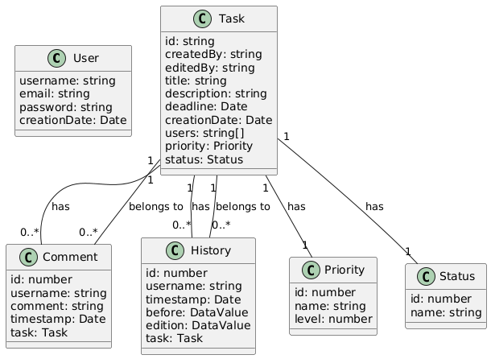

# Sistema de Gestão de Tarefas Colaborativo

### Gabriel Braz Cavalcante Silva

## 📐 Arquitetura

## 🚀 Visão Geral

Este projeto é um sistema full-stack para gestão colaborativa de tarefas, desenvolvido como parte do desafio para a vaga de Full-stack Developer Júnior na Jungle Gaming. O sistema utiliza monorepo, microserviços com NestJS, mensageria com RabbitMQ, autenticação JWT, e uma interface moderna com React, TanStack Router, shadcn/ui e Tailwind CSS.

## 🧱 Estrutura do Projeto

- **apps/**
    - **web/**: Frontend React + TanStack Router + shadcn/ui + Tailwind
    - **api-gateway/**: Gateway HTTP + WebSocket + Swagger
    - **auth-service/**: Microserviço de autenticação (NestJS)
    - **tasks-service/**: Microserviço de tarefas (NestJS)
    - **notifications-service/**: Microserviço de notificações (NestJS + WebSocket)
- **packages/**: Tipos, utilitários, configs compartilhados
- **docker-compose.yml**: Orquestração dos serviços

## 🛠️ Decisões Técnicas

- **Prioridade e Status**: Modelados como entidades separadas para flexibilidade.
- **Banco de Dados**: Utilizado um único banco PostgreSQL para todos os serviços, visando simplicidade.
- **JWT**: O gateway valida tokens localmente para evitar dependência excessiva do auth-service.
- **Mensageria**: RabbitMQ para comunicação entre microserviços e eventos de notificação.
- **UI**: Componentização com shadcn/ui e Tailwind para agilidade e consistência visual.

## ⚡ Funcionalidades

- Autenticação JWT (cadastro, login, refresh)
- CRUD de tarefas com prioridade, status, prazo e atribuição múltipla
- Comentários e histórico de alterações por tarefa
- Notificações em tempo real via WebSocket
- Proteção de rotas e validação de entrada
- Documentação Swagger no API Gateway

## 🐳 Como Executar

1. Clone o repositório
2. Configure variáveis de ambiente conforme `.env.example` de cada serviço
3. Execute `docker-compose up --build`
4. Rode as migrations para criar as tabelas do banco de dados (verifique o IP do banco se necessário, especialmente ao rodar fora do container)
    - Exemplo: `npm run migration` na raiz do projeto
5. Execute o script de seed para preencher as tabelas de Status e Prioridade
    - Exemplo: `npm run seed` em cada serviço
6. Existem seeds com dados de teste para facilitar a validação do sistema
7. Acesse o frontend em `http://localhost:3000` e o Swagger em `http://localhost:3001/api/docs`

## 📝 Problemas Conhecidos & Melhorias

- Centralização de tipos entre serviços pode ser aprimorada.
- Implementar testes unitários e integração.
- Melhorar tratamento de erros e feedbacks visuais.
- Adicionar health checks e logging estruturado.

## ⏱️ Tempo Gasto

- Estudo e prática das ferramentas: alguns dias
- Estruturação do monorepo e configuração do Docker: 2 dias
- Desenvolvimento dos serviços backend: cerca de 4 dias
- Desenvolvimento do frontend: 2 dias
- Notificações (RabbitMQ + WebSocket em tempo real): 1 dia

---
